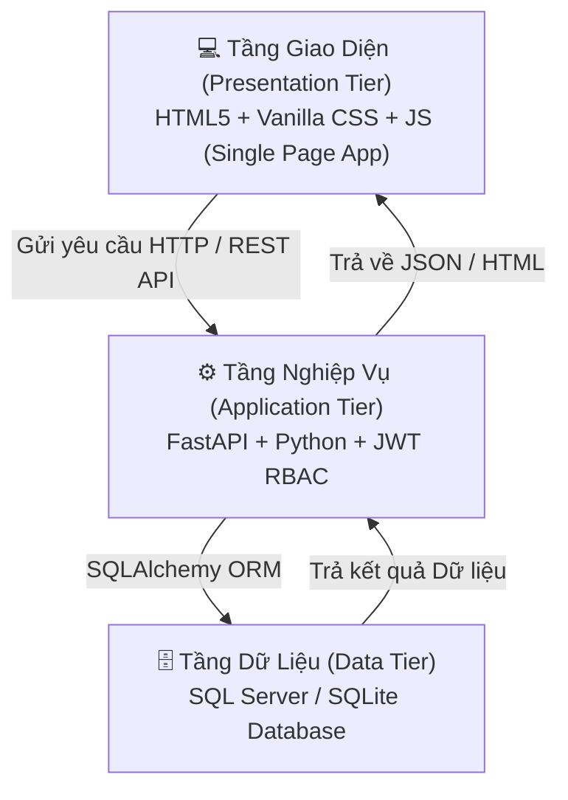
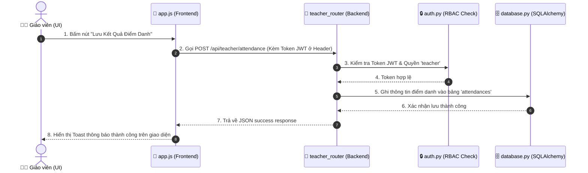

# 🏛️ TÀI LIỆU GIẢI THÍCH KIẾN TRÚC DỰ ÁN QUẢN LÝ SINH VIÊN

Tài liệu này giải thích chi tiết kiến trúc tổng thể, mô hình phân tầng và vai trò nhiệm vụ của từng thành phần trong dự án **Hệ Thống Quản Lý Lớp Học (Classroom Management System)**.

---

## 📐 1. Mô Hình Kiến Trúc 3 Tầng (3-Tier Architecture)

Dự án được xây dựng chuẩn theo mô hình kiến trúc 3 tầng doanh nghiệp (**3-Tier Architecture**), giúp phân tách rõ ràng giữa giao diện, xử lý nghiệp vụ và lưu trữ dữ liệu:



### 🔹 Tầng 1: Presentation Tier (Giao diện người dùng)
* **Công nghệ**: Single Page Application (SPA) xây dựng bằng **HTML5**, **Vanilla CSS** và **Vanilla JavaScript** (ES6+).
* **Vị trí**: `classroom_management/templates/index.html`, `classroom_management/static/`
* **Nhiệm vụ**:
  * Hiển thị giao diện người dùng theo phong cách kính mờ modern glassmorphism.
  * Tự động thay đổi giao diện theo vai trò người dùng (Admin, Giáo viên, Sinh viên).
  * Gọi API bằng `fetch()` và cập nhật giao diện động mà không cần tải lại trang.

### 🔹 Tầng 2: Application Tier (Xử lý nghiệp vụ & API)
* **Công nghệ**: **FastAPI** (Python 3.10+), **PyJWT** (Xác thực token), **Passlib/Bcrypt** (Mã hóa mật khẩu).
* **Vị trí**: `classroom_management/main.py`, `routers/`, `auth.py`, `schemas.py`
* **Nhiệm vụ**:
  * Xác thực người dùng (Authentication) và phân quyền 3 tầng Role-Based Access Control (RBAC).
  * Kiểm tra và ràng buộc dữ liệu đầu vào bằng **Pydantic Schemas**.
  * Cung cấp các API RESTful theo các phân hệ: Auth, Admin, Teacher, Student.

### 🔹 Tầng 3: Data Tier (Lưu trữ cơ sở dữ liệu)
* **Công nghệ**: **SQLAlchemy ORM**, **Microsoft SQL Server** (Doanh nghiệp) hoặc **SQLite** (Fallback Local).
* **Vị trí**: `classroom_management/database.py`, `models.py`, `sql_server_schema.sql`, `classroom.db`
* **Nhiệm vụ**:
  * Ánh xạ các đối tượng lập trình Python thành các bảng dữ liệu quan hệ (ORM).
  * Thực hiện lưu trữ, truy vấn, điểm danh, nhập điểm và tính toán học phí.

---

## 📁 2. Sơ Đồ Cấu Trúc Thư Mục & Vai Trò Từng Tệp Tin

```text
QUAN LY SINH VIEN - THU HA/
├── classroom_management/          # Core Python Enterprise Package
│   ├── __init__.py                # Khai báo gói Python package
│   ├── main.py                    # Application Factory khởi tạo ứng dụng FastAPI
│   ├── database.py                # Cấu hình kết nối CSDL SQL Server & SQLite Fallback
│   ├── models.py                  # SQLAlchemy ORM Data Models (Định nghĩa các bảng DB)
│   ├── schemas.py                 # Pydantic Schemas (Validation dữ liệu API)
│   ├── auth.py                    # Xử lý JWT Token, Mã hóa mật khẩu & Phân quyền RBAC
│   ├── seed.py                    # Khởi tạo dữ liệu mẫu ban đầu
│   ├── routers/                   # Các API Router chia theo từng phân hệ chức năng
│   │   ├── auth_router.py         # API Đăng nhập, Đăng xuất, Hồ sơ cá nhân, Đổi mật khẩu
│   │   ├── admin_router.py        # API Quản trị: Tạo tài khoản, Phân quyền, Tạo môn học, Xếp lịch
│   │   ├── teacher_router.py      # API Giáo viên: Xem lịch dạy, Điểm danh, Nhập điểm sinh viên
│   │   └── student_router.py      # API Sinh viên: Xem lịch học, Đăng ký môn học, Xem điểm, Học phí
│   ├── static/                    # Chứa tài nguyên tĩnh của giao diện
│   │   ├── css/style.css          # Style CSS tùy chỉnh (Giao diện Kính mờ, Layout)
│   │   └── js/app.js              # Logic Javascript điều khiển SPA (Fetch API, Render UI)
│   └── templates/                 # Thư mục chứa giao diện HTML
│       └── index.html             # Trang giao diện duy nhất (Single Page Dashboard)
├── api/
│   └── index.py                   # Vercel Serverless Function Entrypoint (Deploy Vercel)
├── sql_server_schema.sql          # T-SQL Script khởi tạo CSDL ClassroomDB trên SQL Server
├── run.py                         # File chạy dự án ở môi trường Local (chạy Uvicorn Server)
├── pyproject.toml                 # Cấu hình gói tiêu chuẩn Python Enterprise
├── requirements.txt               # Danh sách các thư viện Python phụ thuộc
├── vercel.json                    # Cấu hình Deploy ứng dụng lên Vercel Cloud
├── .gitignore                     # Danh sách loại trừ tệp tin khi push lên Git
├── README.md                      # Tài liệu hướng dẫn cài đặt và sử dụng dự án
└── KIEN_TRUC_DU_AN.md             # Tài liệu giải thích kiến trúc dự án
```

---

## 🔄 3. Luồng Xử Lý Yêu Cầu (Request & Data Flow)

Khi người dùng thực hiện một thao tác trên giao diện (ví dụ: **Giáo viên điểm danh**):



---

## 📊 4. Bảng Tổng Hợp Chức Năng Các Tầng

| Tầng Kiến Trúc | Tệp Tin Đại Diện | Vai Trò Chính |
| :--- | :--- | :--- |
| **Presentation Tier** | [index.html](file:///d:/ki%201%20nam%205/l%E1%BA%ADp%20tr%C3%ACnh/QUAN%20LY%20SINH%20VIEN%20-%20THU%20HA/classroom_management/templates/index.html)<br/>[app.js](file:///d:/ki%201%20nam%205/l%E1%BA%ADp%20tr%C3%ACnh/QUAN%20LY%20SINH%20VIEN%20-%20THU%20HA/classroom_management/static/js/app.js)<br/>[style.css](file:///d:/ki%201%20nam%205/l%E1%BA%ADp%20tr%C3%ACnh/QUAN%20LY%20SINH%20VIEN%20-%20THU%20HA/classroom_management/static/css/style.css) | Hiển thị màn hình làm việc SPA, thu thập thao tác người dùng, gửi request REST API và render dữ liệu lên DOM. |
| **Routing & Control** | [main.py](file:///d:/ki%201%20nam%205/l%E1%BA%ADp%20tr%C3%ACnh/QUAN%20LY%20SINH%20VIEN%20-%20THU%20HA/classroom_management/main.py)<br/>`routers/*.py` | Định tuyến đường dẫn API, điều phối luồng dữ liệu, gọi tầng xử lý bảo mật và giao tiếp DB. |
| **Security & Auth** | [auth.py](file:///d:/ki%201%20nam%205/l%E1%BA%ADp%20tr%C3%ACnh/QUAN%20LY%20SINH%20VIEN%20-%20THU%20HA/classroom_management/auth.py)<br/>[schemas.py](file:///d:/ki%201%20nam%205/l%E1%BA%ADp%20tr%C3%ACnh/QUAN%20LY%20SINH%20VIEN%20-%20THU%20HA/classroom_management/schemas.py) | Mã hóa mật khẩu với Bcrypt, cấp phát JWT Bearer token, phân quyền RBAC 3 tầng (Admin, Teacher, Student) và validate dữ liệu Pydantic. |
| **Data Access Tier** | [database.py](file:///d:/ki%201%20nam%205/l%E1%BA%ADp%20tr%C3%ACnh/QUAN%20LY%20SINH%20VIEN%20-%20THU%20HA/classroom_management/database.py)<br/>[models.py](file:///d:/ki%201%20nam%205/l%E1%BA%ADp%20tr%C3%ACnh/QUAN%20LY%20SINH%20VIEN%20-%20THU%20HA/classroom_management/models.py) | Thiết lập kết nối SQL Server / SQLite Fallback, định nghĩa ánh xạ các bảng CSDL bằng ORM. |
| **Persistence Tier** | `classroom.db`<br/>[sql_server_schema.sql](file:///d:/ki%201%20nam%205/l%E1%BA%ADp%20tr%C3%ACnh/QUAN%20LY%20SINH%20VIEN%20-%20THU%20HA/sql_server_schema.sql) | Lưu trữ vĩnh viễn dữ liệu người dùng, môn học, lịch dạy, kết quả điểm danh, điểm số và học phí. |
